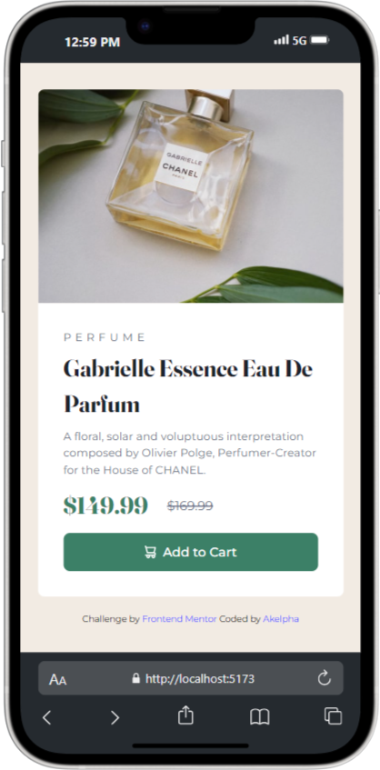
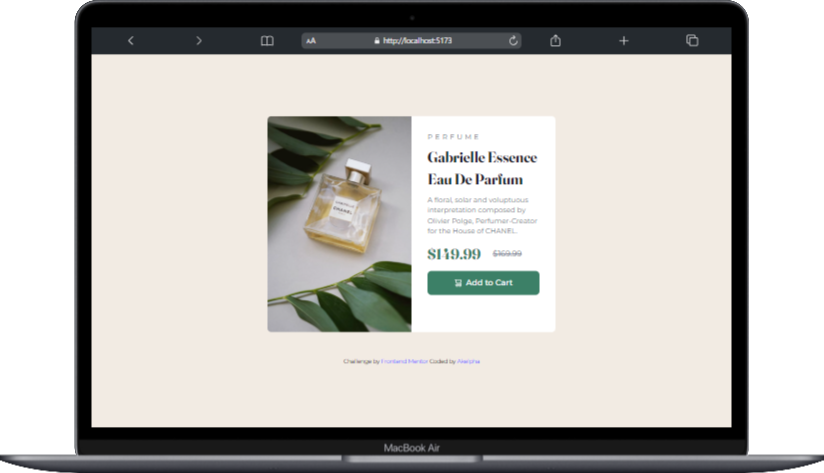

# Frontend Mentor - Product preview card component solution

This is a solution to the [Product preview card component challenge on Frontend Mentor](https://www.frontendmentor.io/challenges/product-preview-card-component-GO7UmttRfa). Frontend Mentor challenges help you improve your coding skills by building realistic projects.

## Table of contents

- [Overview](README.md#overview)
  - [The challenge](README.md#the-challenge)
  - [Screenshot](README.md#screenshot)
  - [Links](README.md#links)
- [My process](README.md#my-process)
  - [Built with](README.md#built-with)
  - [What I learned](README.md#what-i-learned)
  - [Continued development](README.md#continued-development)
  - [Useful resources](README.md#useful-resources)
- [Author](README.md#author)

## Overview

### The challenge

Users should be able to:

- View the optimal layout depending on their device's screen size
- See hover and focus states for interactive elements

### Screenshot




### Links

- Solution URL: [GitHub Link](https://github.com/Akelpha/product-preview-card-component)
- Live Site URL: [Vercel](https://product-preview-card-component-olive.vercel.app/)

## My process

### Built with

- Semantic HTML5 markup
- CSS custom properties
- Flexbox
- Mobile-first workflow
- [TailwindCSS](https://tailwindcss.com/) - CSS library for Styles

### What I learned

During this projet, i have learned how to use tailwindcss and it was so fun!!

```css
@theme {
  --font-sans: "Montserrat", sans-serif;
  --font-serif: "Fraunces", serif;
  --color-dark-cyan: hsl(158, 36%, 37%);
  --color-cream: hsl(30, 38%, 92%);
  --color-very-dark-cyan: hsl(158, 36%, 20%);
  --color-very-dark-blue: hsl(212, 21%, 14%);
  --color-dark-grayish-blue: hsl(228, 12%, 48%);
  --color-white: hsl(0, 0%, 100%);
  --color-attribution: hsl(240, 100%, 65%);
}
```

PS:i have learned also what was the real difference between bash and powershel(let me tell you that i was so funny),i've learned how to use vite correctly and deploy in vercel(it was a realy good and strong fight).

### Continued development

In my future projets, i will focus in framework CSS and JS.I think that it will help me to develop many hard skills.

### Useful resources

- [TailwindCSS](https://tailwindcss.com/) - This helped me for knowing all about classes and configuration.
- [Vite](https://vite.dev/) - This helped me for deployement.

## Author

- Frontend Mentor - [@akelpha](https://www.frontendmentor.io/profile/Akelpha)
- LinkedIn - [@keren-nzira](https://www.linkedin.com/in/keren-nzira/)
